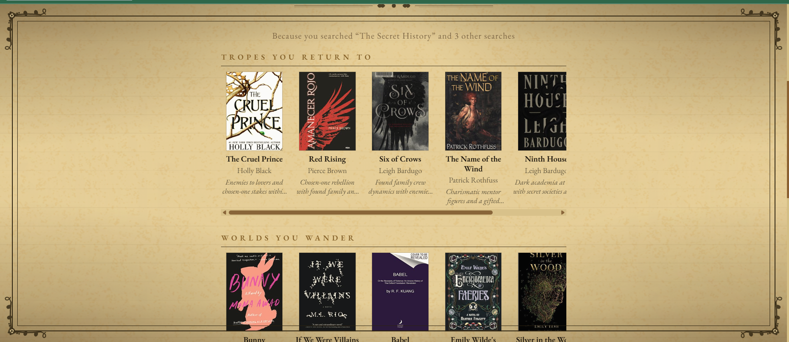

# BookDNA

> Enter a title, an author, or a feeling -- the library will find you a door.

BookDNA is a book recommendation web app with a Victorian manuscript aesthetic. Give it any book and it surfaces categorised recommendations drawn from the Open Library and analysed by an AI that reads the book's DNA.



---

## Why I built this

I love reading -- especially romantasy and fantasy -- and I wanted book recommendations that feel personal rather than algorithmic. Every tool I tried felt like a spreadsheet. I wanted something that felt like stepping into a candlelit library where a very well-read librarian already knew what you were looking for. BookDNA is that librarian.

---

## Features

- **Book search** -- search by title, author, or keyword; BookDNA queries the Open Library and returns the closest match
- **DNA-powered categorised recommendations** -- each result comes with four shelves: *Similar Storyline*, *Similar Tropes*, *Similar World/Setting*, and *Same Vibe*; each book includes a one-line reason it was chosen
- **Hallucination prevention** -- every AI-suggested title is validated against Open Library before it appears; made-up books are silently dropped
- **SQLite caching** -- each book's DNA is cached so repeated searches are instant and free
- **Personalised homepage** -- a "Because you searched..." section surfaces recommendations from your most recent search when you return to the app
- **Anonymous sessions** -- no account needed; your search history lives in a browser session ID stored in localStorage
- **Genre fallback** -- if no API key is configured, the app falls back to Open Library genre recommendations so it always works
- **Victorian aesthetic** -- ornate SVG page borders, decorative friezes, and corner acanthus ornaments give the UI the feel of a printed manuscript
- **Atmospheric mist background** -- layered warm-mist animations create a candlelit, parchment-and-ink feel

---

## How recommendations work

1. You search for a book. The backend queries Open Library and returns the closest match instantly (Phase 1 -- genre recs from Open Library appear immediately).
2. In the background, the backend sends the book's title, authors, and subjects to Claude (Haiku 4.5) and asks it to suggest 6 real books in each of four categories.
3. Every suggested title is validated against Open Library in parallel. Titles that cannot be confirmed are dropped.
4. Validated results replace the genre fallback on screen (Phase 2).
5. The book's DNA is cached in SQLite so the next search for the same book skips the AI call entirely.
6. Open Library search results and validated book lookups are also cached in SQLite for seven days. If Open Library is unavailable, previously cached results are served transparently. A book searched for the first time during an outage shows a friendly message ("The library's archives are unreachable…") rather than a crash; repeat searches always work from cache. Category recommendations follow the same pattern -- cached validations survive outages, and uncacheable candidates are silently dropped so whatever has been validated is still returned.

---

## Tech stack

| Layer | Technology |
|---|---|
| Frontend | React 18, Vite 6 |
| Backend | Python 3, FastAPI, uvicorn |
| AI | Anthropic API (Claude Haiku 4.5) |
| Data source | [Open Library API](https://openlibrary.org/developers/api) -- no key required |
| HTTP client | httpx (async) |
| Cache / history | SQLite (built-in Python) |
| Styling | Plain CSS with custom properties |

---

## Running locally

### Prerequisites

- Python 3.10+
- Node.js 18+
- An Anthropic API key (optional -- the app works without one, using genre fallback)

### 1. Clone

```bash
git clone https://github.com/ksaivarsha/bookdna.git
cd bookdna
```

### 2. Backend

```bash
cd backend
pip install -r requirements.txt
cp .env.example .env   # Windows: copy .env.example .env
# Edit .env and paste your ANTHROPIC_API_KEY (leave blank to use genre fallback)
uvicorn app.main:app --reload
```

The API starts at **http://localhost:8000**.

### 3. Frontend

Open a second terminal:

```bash
cd frontend
npm install
npm run dev
```

The app opens at **http://localhost:5173**.

---

## What I'd build next

1. **Reading list** -- let users bookmark books to a personal list, persisted in localStorage or a lightweight backend store; the session infrastructure is already in place
2. **Deeper personalisation** -- use the full search history (not just the most recent book) to build a taste profile and generate a blended "For You" shelf across multiple books
3. **Genre mood selector** -- let users pick a reading mood (romantasy, sci-fi, thriller, horror) and have the UI retheme itself with a cinematic transition; the theme system and transition infrastructure are already in the codebase

---

## License

MIT
