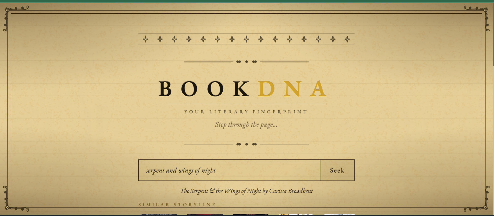
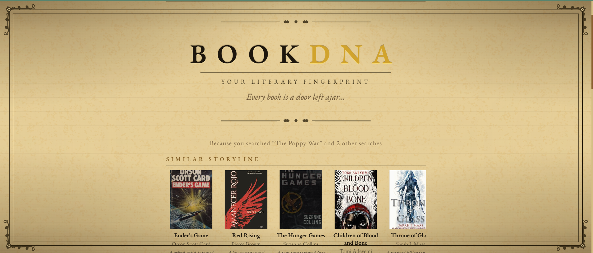
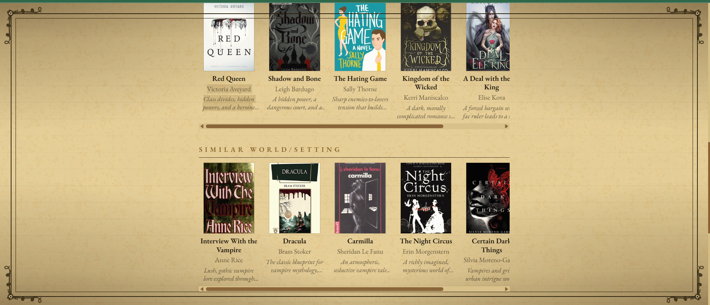

# BookDNA

> Enter a title, an author, or a feeling, and the library will find you a door.

BookDNA is a book recommendation web app with a Victorian manuscript aesthetic. Give it any book and it surfaces categorized recommendations by storyline, tropes, world, and vibe, drawn from the Open Library and analyzed by an AI that reads each book's DNA.


### The library


### For You: personalized from your search history


### Recommendations by world and setting


---

## Why I built this

I love reading, especially romantasy and fantasy, and I wanted book recommendations that feel personal rather than algorithmic. Every tool I tried felt like a spreadsheet. I wanted something that felt like stepping into a candlelit library where a very well-read librarian already knew what you were looking for. BookDNA is that librarian.

---

## Features

- **Book search:** search by title, author, or keyword. BookDNA queries the Open Library and shows the closest match as a featured card with its cover, author, year, description, and DNA.
- **Book DNA:** each searched book gets a profile of its tropes, world/setting, subgenre, tone, and storyline. The tropes show as chips on the featured card, along with the setting and tone.
- **DNA-powered recommendations:** every result comes with four shelves: *Similar Storyline*, *Similar Tropes*, *Similar World/Setting*, and *Same Vibe*. Each book includes a one-line reason it was chosen.
- **Progressive loading:** the featured book appears in about a second and its DNA a couple of seconds later. Placeholder shelves of empty book outlines hold each shelf's place, and each one is replaced as soon as its books are ready.
- **Pre-warmed favorites:** a script caches 50 popular romantasy and fantasy books ahead of time, so searching any of them is instant.
- **Book detail panels:** click any recommended book to open a manuscript-style panel with its full reason and its Open Library description. From there you can search for it ("Seek this book") or open it on Open Library. The panel closes with the X, the Escape key, or a click outside, and works from the keyboard.
- **Personalized For You shelf:** the homepage blends the DNA of your recent searches (recurring tropes, settings, and subgenres) into recommendations made for your taste, excluding books you have already looked up.
- **Shareable searches:** every search lives in the URL (`?q=...`), so the back button works and a search can be shared as a link. The BOOKDNA wordmark and "Return to the library" bring you back to the homepage.
- **Hallucination prevention:** every AI-suggested title is validated against Open Library before it appears. Books that cannot be confirmed are dropped.
- **SQLite caching:** each book's DNA and shelves are cached, so repeat searches skip the AI entirely.
- **Outage resilience:** Open Library lookups are cached, so the app keeps working when Open Library is slow or down.
- **Anonymous sessions:** no account needed. Your search history is tied to a browser session ID stored in localStorage.
- **Genre fallback:** genre picks from Open Library show while the AI works and stay on screen if it is unavailable (or no API key is configured), so the page is never empty.
- **Victorian aesthetic:** ornate SVG page borders, decorative friezes, and corner acanthus ornaments give the UI the feel of a printed manuscript, with layered warm-mist animations for a candlelit, parchment-and-ink atmosphere.

---

## How recommendations work

1. **Search.** `/books/search` takes the top Open Library search match, then fetches its description from the works endpoint (`/works/{id}.json`). Markdown links and trailing source notes are stripped from the description. The frontend shows the book right away as the featured card and adds it to your session history. It then makes two requests in parallel: `/books/related` for genre picks, and `/recommendations/by-category` for the AI shelves. The genre picks come from an Open Library search on the book's first subject, or its first author if it has no subjects, and appear while the AI shelves load.
2. **Extract the DNA profile.** `/recommendations/by-category` streams its results as newline-delimited JSON events. If the book already has a stored profile, it is sent straight away as a `profile` event. Otherwise Claude (Haiku 5.5, with thinking turned off) extracts one from the title, authors, publication year, subjects, and the first 2,000 characters of the description. The profile has `tropes` (3 to 6), `world_setting`, `subgenre`, `tone`, and `storyline_summary`. This runs **at the same time** as the recommendations rather than before them. The profile is saved in the SQLite `book_profile` table, keyed by Open Library work ID, and fills in the DNA on the featured card when it arrives.
3. **Recommend, in two parallel calls.** Two Claude calls start together, both with adaptive thinking and streamed as schema-constrained JSON. The first writes only the *Similar Storyline* shelf (6 books), so it arrives quickly. The second writes *Similar Tropes*, *Similar World/Setting*, and *Same Vibe* together (8 books each), so those three shelves can't repeat each other. Both prompts get the book details and the first 400 characters of the description, plus the stored profile if the book already had one. A new profile is not waited for. Each prompt names the shelves the other call covers, to reduce overlap. Each book comes with a one-line reason. A shelf is handed off as soon as the next one has started. Once all four shelves have arrived, the full candidate lists are cached in `dna_cache`. Cached recommendations are reused only when the book already had a stored profile.
4. **Validate and de-duplicate, shelf by shelf.** Each shelf is validated as soon as it is handed off. Every suggestion is looked up on Open Library by title and author, with a 3-second timeout and one retry. A suggestion is dropped if nothing matches, or if fewer than half of the significant words in its title (longer than two letters) appear in the matched title. The surviving books are then de-duplicated by Open Library work ID against the searched book and every shelf already sent, and cut to six. The shelf goes to the page as a `shelf` event. For a cached book, all four shelves are validated in parallel and de-duplicated the same way, in the order they finish. A final `done` event closes the stream.
5. **Show it.** While the stream is open, a placeholder shelf holds the place of each shelf still to come, directly under the featured card. Genre picks show below them under "From the same stacks". The first shelf to arrive replaces the genre picks, and each later shelf replaces its own placeholder. If the stream fails or no shelf survives, the placeholders disappear and the genre picks stay on screen.
6. **Personalize (For You).** The homepage loads the stored profiles for the last five books in your session history. If none of them has a profile, one is extracted for the most recent book from its title and authors alone. Across those profiles, the backend counts tropes (each book counts a trope once) and keeps the top six. It does the same for world settings and subgenres, keeping the top three of each. Counting uses exact matches after lowercasing and removing punctuation, so "Fae courts" and "fae courts" count together but differently worded settings do not. Claude gets this taste profile with its counts (for example "enemies to lovers (2 of 2 books)"), plus the titles you have already searched. It returns three shelves ordered best match first: *Tropes You Return To*, *Worlds You Wander*, and *Your Subgenres*. The result is cached in `taste_cache` under a hash of the taste profile and searched titles, so Claude is only called again when your taste changes. The suggestions go through the same validation step. Books you have already searched (your last 50 searches) are removed, and so are books that appeared on an earlier shelf.
7. **Details on demand.** Clicking a recommended book opens its detail panel, which fetches the description through `/books/work` (the same cached works lookup).
8. **Survive outages.** Open Library search results and work descriptions are cached in SQLite for seven days. Searches and description fetches have an 8-second timeout and one retry. If a description cannot be fetched, the book is profiled without it. A book searched for the first time during an outage shows a friendly message ("The library's archives are unreachable at the moment") instead of a crash.
9. **Log safely.** Each search logs how long every stage took (`timing stage=... ms=...`) and how many tokens each Claude call used. Claude and Open Library failures are logged with the exception type, stop reason, or HTTP status only. Error messages and request details are never logged, so the API key cannot appear in the logs.

**Without an API key:** no profiles are created and no AI shelves appear. The search page shows the featured book and the genre picks, and For You stays hidden.

**Tradeoffs:** extracting a profile first adds one extra Claude call the first time a book is searched, but it makes each shelf target a specific part of the book's DNA and gives For You something concrete to count. Validating every suggestion adds latency, but it guarantees every recommendation is a real book. Caching profiles, recommendations, and taste shelves trades a little storage for speed and near-zero repeat cost.

---

## Speed

All timings come from the stage logs, on three first-time searches (*The Night Circus*, *Circe*, *Mexican Gothic*). Each search ran against a fresh database, so nothing was cached, and times are measured from pressing Seek.

| | Original (one call, no streaming) | One streamed call | **Now: two parallel calls** |
|---|---|---|---|
| Searched book on screen | 1.4–2.8 s | 0.5–1.4 s | 0.6–1.0 s |
| DNA chips | 26–30 s | 3–4 s | 2.8–3.8 s |
| First shelf | 26–30 s | 8.2–17.1 s | **6.3–8.8 s** |
| Last shelf | 26–30 s | 13.4–23.1 s | 18.0–22.5 s |
| Validation pass rate | 97% | 97% | 96% |
| Shelf sizes after de-duplication | not checked | 17–22 of 24 books | 5 of 24 shelves below 6 books (one with 3) |
| Cost per first-time search | ~$0.0022 | ~$0.0017 | ~$0.0024 |

"Now" excludes one run where Open Library took 15 seconds just to return the searched book. Repeat searches, and the 50 pre-warmed books, skip Claude entirely and cost nothing.

### What was tried

The goal was a first shelf in about 5 seconds with at least 95% of suggestions passing validation. **That goal was not reached.** Every option that hit 5 seconds failed one of the two requirements:

| Option | First shelf | Last shelf | Validation | Books kept after de-dup (of 24) | Cost/search |
|---|---|---|---|---|---|
| One streamed call (previous) | 8.2–17.1 s | 13.4–23.1 s | 97% | 17–22 | $0.0017 |
| A: low thinking effort | 6.5–7.5 s | 11.3–12.3 s | 93% ✗ | — | $0.0011 |
| B: recommendations alongside the profile (no profile in prompt) | 11.1–12.1 s | 15.2–16.6 s | 94% ✗ | — | $0.0018 |
| C: four parallel calls, one per shelf | 7.8–9.3 s | 10.7–13.4 s | 99% | 12–16 ✗ | $0.0021 |
| D: 5 books per shelf | 12.0–14.0 s | 15.2–17.6 s | 92% ✗ | — | $0.0016 |
| B + C | 3.8–6.2 s | 6.2–7.3 s | 97% | 8–13 ✗ | $0.0018 |
| B + C + D | 3.8–5.9 s | 5.2–7.3 s | 100% | 6–12 ✗ | $0.0015 |
| B + C, low effort | 3.8–6.1 s | 5.2–10.9 s | 97% | 11–13 ✗ | $0.0012 |
| C, low effort | 6.3–6.8 s | 7.2–12.8 s | 92% ✗ | — | $0.0013 |
| B + C, 9 asked / 6 kept | 8.1–19.5 s | 14.0–23.6 s | 98% | 16–22 | $0.0034 |
| H: 1 + 3 calls | 4.7–9.1 s | 12.2–18.0 s | 97% | 18–22 | $0.0021 |
| H2: 2 + 2 calls | 8.3–10.8 s | 11.3–14.9 s | 98% | 17–23 | $0.0023 |
| H, low effort on the first call | 4.4–4.9 s | 14.9–18.2 s | 92% ✗ | 17–20 | $0.0020 |
| H2, low effort on the first call | 5.1–5.9 s | 11.1–12.6 s | 92% ✗ | 17–20 | $0.0018 |
| **H, 8 asked / 6 kept (shipped)** | **6.3–8.8 s** | **18.0–22.5 s** | **96%** | 3–6 per shelf | **$0.0024** |

Why 5 seconds was out of reach:

- **Low effort fails validation.** Turning thinking down is the only setting that reliably gets a shelf out in under 5 seconds, and it consistently lets more invented or mismatched titles through: 92–93% instead of 96–99%.
- **Parallel calls repeat each other.** Calls generated separately can't see each other's picks, so they reach for the same obvious read-alikes. With four separate calls, 8–16 of 24 suggestions repeated another shelf. After de-duplication, shelves shrank to as few as 0–2 books. Naming the other shelves in each prompt barely helped. Asking for 9 books and keeping 6 refilled the shelves, but made the call slow again.
- **The shipped compromise.** A fast single-shelf call for *Similar Storyline* runs beside one call that writes the other three shelves together. The storyline shelf arrives about 2× sooner than before. The three shelves that share a call can't repeat each other; they are only de-duplicated against the storyline shelf. Asking for 8 books per shelf and keeping 6 makes thin shelves rare, but they still happen: the storyline call and the three-shelf call sometimes pick the same classics. It also makes the last shelf 4–6 seconds slower than with 6 books.
- **A short validation timeout.** Open Library validation lookups time out after 3 seconds (8 seconds for searches and descriptions), so one slow response can't hold a shelf back for long. During an Open Library slowdown this can drop a real book.

Other things that help the wait feel shorter: placeholder shelves appear the moment the featured book does, and the 50 most popular books are cached in advance.

### Pre-warming the cache

`backend/scripts/prewarm.py` runs a list of 50 popular romantasy and fantasy books through the same code as a real search, caching each book's Open Library lookups, DNA profile, and validated shelves. It never writes search history, so For You is unaffected. Books that are already cached are skipped. A full run takes about 5 minutes and costs about $0.12.

```bash
cd backend
python scripts/prewarm.py --db /tmp/scratch.db                    # try it on a scratch database
python scripts/prewarm.py --db ../bookdna.db --i-mean-the-real-db  # warm the app's database
```

---

## Tech stack

| Layer | Technology |
|---|---|
| Frontend | React 18, Vite 6 |
| Backend | Python 3, FastAPI, uvicorn |
| AI | Anthropic API (Claude Haiku 5.5) |
| Data source | [Open Library API](https://openlibrary.org/developers/api), no key required |
| HTTP client | httpx (async) |
| Cache and history | SQLite |
| Styling | Plain CSS with custom properties |

---

## Running locally

### Prerequisites

- Python 3.10+
- Node.js 18+
- An Anthropic API key (optional: without one, the app uses the genre fallback)

### 1. Clone

```bash
git clone https://github.com/ksaivarsha/bookdna.git
cd bookdna
```

### 2. Backend

```bash
cd backend
pip install -r requirements.txt
cp .env.example .env   # Windows: copy .env.example .env
# Edit .env and add your ANTHROPIC_API_KEY (leave it blank to use the genre fallback)
uvicorn app.main:app --reload
```

The API starts at **http://localhost:8000**.

### 3. Frontend

Open a second terminal:

```bash
cd frontend
npm install
npm run dev
```

The app opens at **http://localhost:5173**.

---

## What I'd build next

1. **Normalized settings:** have Claude pick each book's world setting from a fixed list instead of writing free text, so For You can count settings across books the way it already counts tropes and subgenres.
2. **Reading list:** bookmark books to a personal list. The session infrastructure is already in place.
3. **Fuller shelves after de-duplication:** run the three-shelf call after the *Similar Storyline* shelf instead of beside it, so its prompt can exclude the storyline picks by name. Today the two calls sometimes choose the same classics, and de-duplication can leave the *Similar Tropes* shelf with only 3–4 books.

---

## License

MIT